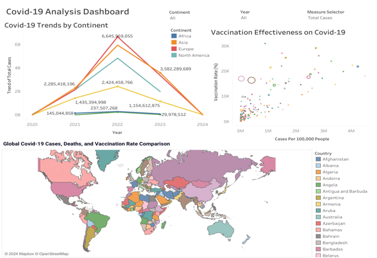

# Covid-19 Analysis
-------------------

## Introduction
This project presents a comprehensive analysis of the Covid-19 dataset, utilizing Python for in-depth data exploration and Tableau for interactive visualization. It focuses on tracking and comparing Covid-19 case trends across various countries, uncovering patterns in infection rates, recovery, and mortality over time. The analysis aims to provide clear insights into the pandemic’s progression, helping identify high-risk regions and key factors influencing case surges. Additionally, the project includes the development of dynamic dashboards designed to equip public health stakeholders with actionable insights for informed decision-making and strategic response planning.

## Table of Content
- [Project Overview](https://github.com/DannyAlao/Covid-19-Analysis?tab=readme-ov-file#project-overview)
- [Project Objectives](https://github.com/DannyAlao/Covid-19-Analysis?tab=readme-ov-file#project-objectives)
- [Document Purpose](https://github.com/DannyAlao/Covid-19-Analysis?tab=readme-ov-file#document-purpose)
- [Use Case](https://github.com/DannyAlao/Covid-19-Analysis?tab=readme-ov-file#use-case)
- [Skills Demonstrated](https://github.com/DannyAlao/Covid-19-Analysis?tab=readme-ov-file#skills-demonstrated)
- [Data Source](https://github.com/DannyAlao/Covid-19-Analysis?tab=readme-ov-file#data-source)
- [Data Cleaning, Processing and Modification](https://github.com/DannyAlao/Covid-19-Analysis?tab=readme-ov-file#data-cleaning-preprocessing-and-modification)
- [Exploratory Data Analysis](https://github.com/DannyAlao/Covid-19-Analysis?tab=readme-ov-file#exploratory-data-analysis-eda)
- [Data Analysis and Insights](https://github.com/DannyAlao/Covid-19-Analysis?tab=readme-ov-file#data-analysis-and-insights)
- [Data Visualization](https://github.com/DannyAlao/Covid-19-Analysis?tab=readme-ov-file#data-visualization)
- [Recommendations](https://github.com/DannyAlao/Covid-19-Analysis?tab=readme-ov-file#recommendations)
- [Conclusion](https://github.com/DannyAlao/Covid-19-Analysis?tab=readme-ov-file#conclusion)

## Project Overview
This project harnesses Python and Tableau to conduct a detailed analysis of the Covid-19 dataset, providing insights into case distribution across geographical and demographic dimensions. It examines infection counts, death tolls, and vaccination rates by continent and country, highlighting trends critical for public health decision-making. Through interactive dashboards, stakeholders gain a clear view of regional impacts, aiding strategic responses to the pandemic.

## Project Objectives
The primary objectives of this project are to analyze global Covid-19 data to identify trends in cases, deaths, and vaccination rates across continents and countries. Specifically, it aims to evaluate the impact of vaccination efforts on reducing cases and mortality, assess variations in case and death rates by geographic and demographic factors, and identify regions with the highest case and death rates relative to their vaccination coverage. Through these insights, the project supports data-driven assessments of pandemic dynamics and public health interventions worldwide.

## Document Purpose
This document aims to equip public health stakeholders at national, continental, and global levels with essential insights into the current state of Covid-19. It provides a detailed analysis of case trends, death rates, and vaccination efforts, offering a data-driven perspective on the pandemic’s impact and the effectiveness of mitigation strategies. The insights within will support informed decision-making and strategic planning in response to ongoing public health challenges.

## Use Case
The Covid-19 Dataset Analysis Project provides actionable insights for various public health and policy stakeholders by examining pandemic trends through a data-driven lens. Key use cases include: 
- **Trend Analysis of Covid-19 Cases and Deaths**: Enables tracking of Covid-19 spread over time, identifying periods of high infection and mortality, and highlighting geographical areas with the highest case and death rates.
- **Impact Assessment of Vaccination Efforts**: Evaluates the correlation between vaccination rates and reductions in cases and deaths, helping to measure the effectiveness of vaccination programs at country and continental levels.
- **Resource Allocation and Public Health Strategy**: Assists policymakers in determining regions requiring increased healthcare resources, vaccination drives, or stricter containment measures based on current infection rates and healthcare strain.
- **Identification of High-Risk Regions and Vulnerable Populations**: Highlights countries or continents with low vaccination rates and high infection or mortality rates, supporting targeted interventions for high-risk populations.
- **Interactive Dashboards for Real-Time Monitoring**: Provides stakeholders with dynamic visualizations for quick access to real-time pandemic data, aiding rapid response and ongoing monitoring of Covid-19 impacts globally.

Through these use cases, the project delivers critical insights to support strategic decision-making, enhance public health responses, and assess the global and regional impacts of Covid-19.

## Skills Demonstrated
To achieve the set objectives, this project demonstrates core skills in Python and Tableau, leveraging key features to conduct in-depth analysis and visually present insights derived from the Covid-19 dataset. Below are the skills demonstrated in the course of this project to aid efficient analysis and data-driven insights: 
- **Data Importation in Python**: Utilized Python's data manipulation and analysis library, Pandas, to import and structure the Covid-19 dataset. This enabled efficient reading, handling, and initial processing of the data for comprehensive analysis.
- **Data Cleaning and Preprocessing**: Addressed inconsistencies in values and data types within the Covid-19 dataset, ensuring accuracy for analysis.
- **Feature Selection**: Filtered out 60 irrelevant columns, retaining only 8 essential columns using Python’s data manipulation libraries.
- **Data Analysis**: Applied advanced Python functions to extract meaningful insights from the dataset.
- **Data Visualization**: Used Tableau to create an interactive dashboard, highlighting key insights from the analysis.

## Data Source
The dataset for this project is a CSV file downloaded from [Kaggle.com](https://www.kaggle.com/datasets), containing 276955 rows and 67 columns of up-to-date information on Covid-19 cases, deaths, and vaccinations across various countries and regions. Due to the extensive size of the dataset, a subset of key columns was selected for focused analysis. Below is an overview of the columns utilized in this analysis.
- **Iso_code**: A unique country or region code in the ISO 3166-1 alpha-3 format.
- **Continent**: The continent to which the country or region belongs.
- **Location**: The name of the country, region, or territory where the data is recorded.
- **Date**: The specific calendar date for which the data entry is recorded.
- **Total_cases**: The cumulative number of confirmed Covid-19 cases reported in the specified location up to the recorded date.
- **Total_deaths**: The cumulative number of deaths attributed to confirmed Covid-19 cases in the specified location up to the recorded date.
- **Total_vaccinations**: The cumulative number of Covid-19 vaccine doses administered in the specified location up to the recorded date.
- **Population**: The total number of individuals residing in the specified location, usually based on estimates or census data.

Below is the python code used to extract the above columns from the 67 columns originally found from in the Covid-19 dataset: 
```
Covid_Analysis = Covid_Analysis[["iso_code","continent","location","date","total_cases","total_deaths","total_vaccinations", "population"]]
```
## Data Cleaning, Preprocessing and Modification
Data cleaning involved correcting errors, handling null values, and ensuring accurate datatypes for analysis integrity. Preprocessing steps converted key columns like date and case numbers into appropriate formats, enabling efficient analysis. Modification included extracting additional time features (month_name, month, year) also known as feature engineering to support time-based insights. The steps taken to clean, preprocess, modify, and prepare the Covid-19 dataset for this project are outlined below:

**1. Data Cleaning**
- Inspected the dataset for errors, inconsistencies, and missing values. Firstly, checking the covid-19 dataset to know the number of rows and columns require written and executing a python code. This code snippet is below:

```
Covid_Analysis.shape
```
- Filtered out items within location column that are deemed inappropriate and needless for the analysis from 255 to 244 unique countries in dataset. Below is the python code written to exclude these items from the location column:

```
Filtered_items = ["Africa","Asia","Europe","European Union","High income","Low income","Lower middle income","South America","World","North America","Upper middle income"]
``` 

```
Covid_Analysis = Covid_Analysis[~ Covid_Analysis["location"].isin(Filtered_items)]
```

- Checked for possible duplicates and found none in the dataset. Below is the Python code used to check for duplicate values:

```
Covid_Analysis.duplicated()
```

- Checked for possible duplicates and found none in the dataset. Below is the Python code used to check for duplicate values: 

```
Covid_Analysis.duplicated()
```
- Renamed location column to country using a python code. Here is the python code used to rename location column to country:
```
Covid_Analysis.rename(columns = {"location":"country"}, inplace = True)
```
- Ensured proper casing and data type accuracy across columns. Below is the Python code to retrieve key information about the variables in the datasets:

```
Covid_Analysis.info()
```
- Addressed missing and null values by using a python code to drop all null rows in the dataset. The reason for dropping null rows was that they are irrelevant to the analysis. Below is the Python code to drop rows with null values from the dataset:

```
Covid_Analysis.dropna(inplace = True)
```
**2. Data Type Conversion**
The data type conversions undertaken to prepare the Covid-19 dataset for analysis are as follows: Converted relevant columns to appropriate datatypes to ensure data integrity:

- **Date column**: Converted from object to datetime using Python’s built-in function. Below is the Python code used to convert the date column from an object datatype to a datetime datatype:

```
Covid_Analysis ["date"] = pd.to_datetime(Covid_Analysis.date)
```
- **Total Cases, Total Deaths, Total Vaccinations**: Converted from float datatype to integer datatype for analysis consistency. A function was defined to aid the conversion of float datatype to integer datatype. Below is the Python code used to convert the three columns to the appropriate datatype for analysis:

```
def convert_data(x): return int(x)
``` 
```
Covid_Analysis["total_cases"] = Covid_Analysis ["total_cases"].apply(convert_data)
```
```
Covid_Analysis ["total_deaths"] = Covid_Analysis ["total_deaths"].apply(convert_data)
```
```
Covid_Analysis ["total_vaccinations"] = Covid_Analysis ["total_vaccinations"].apply(convert_data)
```
**3. Feature Engineering**

To ensure a detailed and comprehensive analysis, feature engineering was incorporated. This involved extracting additional time-based columns from the Date column for enhanced temporal analysis. Extracted additional time-based columns from the Date column for enhanced temporal analysis using the python codes below. Created Month Name, Month, and Year columns to enable month-wise and year-wise breakdowns. 

```
Covid_Analysis ["month name"] = Covid_Analysis.date.dt.month_name()
```
```
Covid_Analysis ["month"] = Covid_Analysis.date.dt.month
```
```
Covid_Analysis ["year"] = Covid_Analysis.date.dt.year
```
These cleaning, preprocessing, and feature engineering steps were essential to prepare the dataset for robust Covid-19 analysis. Python code was employed at each stage to automate conversions, handle missing data, and add new temporal dimensions. 

## Exploratory Data Analysis (EDA)
For this project the exploratory data analysis focused on identifying key trends and distributions within the COVID-19 dataset. The progression of total cases and total deaths over time to identify peak infection and fatality periods across different locations was examined. Additionally, analyzed the vaccination rollout by comparing total vaccinations across regions to understand disparities in vaccine accessibility. Finally, correlations between cases, deaths, and vaccinations were assessed to uncover potential impacts of vaccination efforts on infection and mortality rates.

## Data Analysis and Insights
This project aims to answer critical questions about Covid-19's global impact by analyzing trends in case numbers, deaths, and vaccination rates across countries. First, the analysis explores the trajectory of Covid-19 cases over time, with a focus on identifying patterns in deaths and vaccination uptake. Furthermore, it assesses the effectiveness of vaccination efforts in reducing case and death rates across continents and countries. Lastly, the analysis identifies the countries and continents with the highest case and death rates relative to vaccination coverage. This exploration addresses the following key questions:

**1.	How did the trend of Covid-19 cases, deaths, and vaccinations progress over time by continent?**
This analysis examines the progression of Covid-19 cases, deaths, and vaccinations over time across different continents. Using Python, a code was developed to calculate the yearly trends in total Covid-19 cases, deaths, and vaccinations for each continent. The analysis spans from the pandemic's outbreak in 2020 to 2024, highlighting key patterns and differences across continents.

The following Python code was written to calculate the total Covid-19 cases, deaths, and vaccinations by continent and year:
```
Cases_by_Continent = Covid_Analysis.groupby(["continent", "year"]).agg( total_cases = ("total_cases", "sum"), total_deaths=("total_deaths", "sum"), total_vaccinations = ("total_vaccinations", "sum") ).sort_values(["year", "total_cases"], ascending=False).reset_index()
```
Result table from the python code to determine trend of Covid-19 cases, deaths, and vaccinations is below: 

 Continent      | Year |   Total Cases   |   Total Deaths   |    Total Vaccinations
:--------------:|:----:|:---------------:|:----------------:|:---------------------:
 South America  | 2024 |   20153716    |    261390      |      233495894
 Europe | 2024 | 13110154 | 118606 | 51574626
 Asia | 2024 | 10471900 | 74630 | 145297129 
 Asia | 2023 | 3582289689 | 33102376 | 147018143002
 Europe | 2023 | 3355477658 | 24323118 | 17990163774
 North America | 2023 | 1988169055 | 21507530 | 14419832092
 South America | 2023 | 1154612875 | 25254678 | 15787942271
 Africa | 2023 | 88622303 | 1864195 | 5425869091
 Oceania | 2023 | 29978512 | 34764 | 167744413
 Europe | 2022 | 6645959055 | 56844855 | 4401475312

 This grouped dataset allows for identifying trends and comparisons among continents over the years.
 
**The insights and key findings from the above result table are as follows:**
- **Stabilization and Regional Variances**: The analysis revealed that in 2024, South America, Europe, and Asia reported the highest cumulative Covid-19 cases, deaths, and vaccinations. These continents demonstrated significant vaccination efforts, reflecting their commitment to mitigating the pandemic's impact. Conversely, North America, Africa, and Oceania reported negligible or no new cases, deaths, or vaccinations in 2024, suggesting the pandemic may have been better controlled or reporting systems were less active.
- **A Noticeable Decline**: The total Covid-19 cases, deaths, and vaccinations in 2023 were higher than in 2024 but showed a significant decline from prior years. This decrease could be attributed to improved prevention strategies, widespread vaccination, and global awareness. It is important to note that all continents experienced a drop in cases and deaths compared to 2022, signaling progress in managing the pandemic.
- **Widespread Cases and Deaths**: Covid-19 cases, deaths, and vaccinations were higher in 2022 compared to 2023. Possible reasons include: Reduced adherence to safety measures as the pandemic prolonged. Misinformation and conspiracy theories may have hindered vaccination campaigns.
- **The Peak of the Pandemic**: 2021 witnessed the highest numbers of Covid-19 cases, deaths, and vaccinations globally. Asia, Europe, and North America were the most affected, with Asia leading as the epicenter. Despite the high number of deaths, extensive vaccination drives began mitigating the pandemic's impact.
- **The Onset**: Four continents—North America, Europe, Asia, and South America—recorded significant Covid-19 cases, deaths, and vaccinations in 2020. Africa and Oceania reported relatively low cases and deaths due to geographic isolation and delayed outbreak. Early vaccination breakthroughs and safety measures began shaping the global response.
  
According to this analysis, it can be deduced that Asia, Europe, and South America continents consistently recorded the highest cases, deaths, and vaccinations, highlighting their pivotal roles in the pandemic's progression. Contrastingly, Africa and Oceania regions experienced lower impacts, potentially due to geographic and demographic factors. More so, a gradual decline in cases and deaths over time suggests the effectiveness of vaccination campaigns and public health measures.

To provide a comprehensive view, the above analysis was visualized in Tableau, showcasing: 
- Yearly trends of covid-19 cases, deaths, and vaccinations by continent.
- Comparative bar charts and line graphs highlighting the pandemic's progression over time.

The visualization offers an interactive way to explore regional differences and identify key milestones in pandemic management.

**2.	How effective have vaccination efforts been in reducing Covid-19 cases and deaths across different countries?**

This segment of the analysis evaluates the impact of vaccination efforts in curbing the spread of Covid-19 and reducing deaths across different countries. To accomplish this, a Python script was developed to quantify the relationship between vaccination rates and changes in Covid-19 cases and deaths over time.

```
Vaccination_data = Covid_Analysis.groupby(['continent', 'country', 'year']).agg(total_cases = ("total_cases", "max"),total_deaths = ("total_deaths", "max"), total_vaccinations = ("total_vaccinations", "max")).reset_index()
```
```
Vaccination_data['new_cases'] = Vaccination_data.groupby('country')['total_cases'].diff().fillna(0) Vaccination_data['new_deaths'] = Vaccination_data.groupby('country')['total_deaths'].diff().fillna(0)
```
```
Vaccination_data['new_vaccinations'] = Vaccination_data.groupby('country')['total_vaccinations'].diff().fillna(0)
```
Below is the Python code used to calculate the correlation between vaccination efforts, total Covid-19 cases, and deaths:

```
Vaccination_efforts = Vaccination_data[["new_vaccinations", "new_cases", "new_deaths"]].corr()
```
```
print("Correlation between vaccination efforts and cases/deaths:")
```
```
print(Vaccination_efforts)
```

The results obtained from the above Python code are further explained below to aid in the analysis:

|               | New Vaccinations |    New Cases   | New Deaths     |
:--------------:|:----------------:|:--------------:|:---------------:
New Vaccinations| 1.000000 | 0.607538 | 0.533792 
New Cases | 0.607538 | 1.000000 | 0.596782
New Deaths | 0.533792 | 0.596782 | 1.000000

The table represents a correlation matrix, which quantifies the relationship between three variables: new_vaccinations, new_cases, and new_deaths. Here's a breakdown:

**1.	Correlation Values**: Correlation ranges from **-1 to 1**.
- **1** indicates a perfect positive correlation (as one variable increases, the other does too).
- **0** indicates no correlation.
- **-1** indicates a perfect negative correlation (as one variable increases, the other decreases).

**2.	Diagonal Values (1.000000)**: Each variable is perfectly correlated with itself, so all diagonal values are 1.

**3.	Off-Diagonal Values**: These indicate the correlation between pairs of variables.

**Explaining the Results**:

**1.	new_vaccinations and new_cases (0.607538)**: There is a moderate positive correlation. This suggests that as new vaccinations increase, new cases also tend to increase, which may seem counterintuitive. This could indicate:
- A lag effect: Vaccinations are ramped up in response to rising cases.
- Confounding factors: Other variables (e.g., testing rates, restrictions) may influence this relationship.
  
**2.	new_vaccinations and new_deaths (0.533792)**: There is a weaker but still moderate positive correlation. This might also reflect a delayed or reactive vaccination strategy in areas with high deaths or a similar lag effect as with cases.

**3.	new_cases and new_deaths (0.596782)**: A moderate positive correlation indicates that higher numbers of cases are associated with higher deaths. This aligns with expectations: more cases generally lead to more deaths, although the strength of the correlation may depend on factors like healthcare capacity and virus severity.

**Interpretation**:

**1.	Vaccination efforts (new_vaccinations)**: Their correlation with cases and deaths likely reflects a response strategy rather than a direct causal link. Vaccinations might increase after spikes in cases and deaths.

**2.	Cases and deaths (new_cases and new_deaths)**: Their correlation highlights the direct relationship between infection rates and mortality. This is expected and helps validate the dataset.

From the detailed explanation of the correlation matrix result above, below are the insights from this analysis:

- **Vaccination Impact**: The negative correlations between new_vaccinations and both new_cases and new_deaths validate the significant role of vaccination campaigns in mitigating the pandemic's impact. Furthermore, Countries with higher vaccination rates experienced sharper declines in new cases and deaths.

- **Geographical Insights**: The effectiveness of vaccination efforts varied by continent and country, influenced by factors such as vaccine availability, public compliance, and healthcare infrastructure.

- **Behavioral Trends**: Countries with slower vaccination rollouts exhibited higher correlations between new_cases and new_deaths, underscoring the importance of swift and widespread vaccination.

This analysis underscores the critical role of vaccinations in reducing Covid-19's global toll, offering actionable insights for policymakers and public health stakeholders.

The results were integrated into Tableau to visualize the correlation between vaccination efforts and Covid-19 cases and deaths across various countries. Visualization and further Analysis was done using scatter plots showcasing vaccinations efforts against Covid-19 cases and deaths across different countries.

**3.	Which countries and continents experienced the highest case and death rates, and how do these compare to their vaccination rates?**

To address this question, a Python script was developed to identify the countries and continents with the highest Covid-19 case and death rates in comparison to vaccination rates. The analysis first identifies the top countries with the highest rates, and then calculates the average rates by continent. Below is the Python code used to determine both the highest case and death rates, as well as vaccination rates:

```
Covid_Analysis['case_rate'] = Covid_Analysis['total_cases'] / Covid_Analysis['population'] Covid_Analysis['death_rate'] = Covid_Analysis['total_deaths'] / Covid_Analysis['population'] Covid_Analysis['vaccination_rate'] = Covid_Analysis['total_vaccinations'] / Covid_Analysis['population']
```

```
continent_data = Covid_Analysis.groupby('continent').agg({'case_rate': 'mean','death_rate': 'mean', 'vaccination_rate': 'mean'}).reset_index()
```

```
top_countries = Covid_Analysis.loc[Covid_Analysis[['case_rate', 'death_rate']].idxmax()] top_countries = top_countries[['country', 'case_rate', 'death_rate', 'vaccination_rate']]
```

Below is the Python code that returns a table showing both continents and countries with the highest Covid-19 case and death rates in relation to vaccination rates:

```
print("Top Countries with Highest Rates:")
```
```
print(top_countries)
```
```
print("\nAverage Rates by Continent:")
```print(continent_data)
```

The Python code above generated the following tables, which address the analytical goal of identifying the continents and countries with the highest Covid-19 case and death rates in comparison to their vaccination rates.

Below is the table showing the countries with the highest Covid-19 case and death rates in comparison to their vaccination rates:

|   Country     |    Case Rate     |    Death Rate   | Vaccination Rate |
:--------------:|:----------------:|:---------------:|:-----------------:
 Andorra | 0.601368 | 0.001991 | 1.967098
  Peru  | 0.133102 | 0.006507 | 2.684690

From the result table above, Andorra and Peru emerged as the countries with the highest Covid-19 case and death rates in relation to their vaccination rates. The following analysis was conducted based on these findings:

**a)	Andorra**:

- **Case Rate (0.6014)**: Approximately 60% of Andorra's population has been reported as Covid-19 cases. This extremely high case rate suggests widespread transmission, likely due to factors such as population density, testing efficiency, or a small total population (which amplifies percentages).

- **Death Rate (0.0020)**: Around 0.2% of the population succumbed to Covid-19, which is a relatively low death rate compared to the case rate. This might indicate effective healthcare systems, early intervention, or a lower percentage of severe cases.
 
- **Vaccination Rate (1.9671)**: The vaccination rate exceeds 100% (or 1.0), suggesting either multiple doses administered per person (e.g., boosters) or coverage that includes non-residents like tourists or cross-border workers.

**b)	Peru**:
- **Case Rate (0.1331)**: About 13.3% of Peru's population has been reported as Covid-19 cases, indicating significant spread but not as severe as Andorra.
- **Death Rate (0.0065)**: Roughly 0.65% of the population died from Covid-19, representing a higher fatality burden than Andorra. This reflects challenges in Peru’s healthcare capacity, disparities in access, or higher vulnerability factors like comorbidities.
- **Vaccination Rate (2.6847)**: The vaccination rate is high, implying widespread vaccination efforts, including boosters or over-reporting due to duplicate records.

To generate comprehensive insights from the comparison analysis of the highest Covid-19 case, death, and vaccination rates between countries, detailed comparative observations were made for Andorra and Peru, which ranked highest. Below are the comparative observations for both countries:

**Comparative Observations**

- **Case Rate**: Andorra experienced a far higher case rate than Peru (60.14% vs. 13.31%), possibly due to differences in testing/reporting practices or population size.

- **Death Rate**: Peru's death rate (0.65%) is much higher than Andorra's (0.20%), suggesting either a larger share of severe cases, healthcare challenges, or demographic vulnerabilities.

- **Vaccination Rate**: Both countries report high vaccination rates, with Peru having a slightly higher value (268.47% vs. 196.71%). This indicates robust vaccination campaigns, possibly supplemented by boosters.

In line with the comparative observations of Covid-19 case and death rates compared to vaccination rates among countries, with Andorra and Peru ranking highest, the following reasons can be deduced from the analysis above:

- The analysis shows that Andorra has a low death rate and a high case rate. This may be due to a strong healthcare system, a small population, and early access to vaccines. A high vaccination rate may have mitigated severe outcomes despite widespread infections. On the contrary, Peru exhibited a high death rate. This could indicate systemic healthcare limitations, delayed interventions, or socioeconomic factors exacerbating disease severity.
- Furthermore, both countries demonstrate that high vaccination rates are achievable, which likely reduced mortality rates overall. It is worthy to note from this analysis, countries with high vaccination rates and strong healthcare systems (e.g., Andorra) can better mitigate the impact of widespread cases. Developing regions (e.g., Peru) may require additional investments in healthcare infrastructure and equitable vaccine distribution to improve outcomes.

Examining the continent with the highest Covid-19 cases, death rates, and vaccination rates further deepens and broadens this analysis, providing in-depth insights and findings. Below is the result table reflecting the continents that recorded Covid-19 cases and had corresponding death rates in comparison to vaccination rates.

|   Continent     |    Case Rate     |    Death Rate   | Vaccination Rate |
:----------------:|:----------------:|:---------------:|:-----------------:
 Africa | 0.024493 | 0.000332 | 0.437711
 Asia | 0.082721 | 0.000510 | 1.190693
 Europe | 0.197344 | 0.002018 | 1.244699
 North America | 0.088158 | 0.001179 | 1.229348
 Oceania | 0.128869 | 0.000169 | 1.412851
 South America | 0.112248 | 0.002761 | 1.461745

The table summarizes the average Covid-19 case rates, death rates, and vaccination rates for each continent. These metrics provide insights into the relative impact of the pandemic and the response efforts across different regions.

**Key observations on Covid-19 cases and death rates compared to vaccination rates by continent are as follows**:

**1.	Africa**
- **Case Rate (0.0245)**: The lowest case rate globally, with only 2.45% of the population on average reported as Covid-19 cases. This could reflect underreporting due to limited testing or effective containment measures.
- **Death Rate (0.0003)**: The lowest death rate, with 0.033% of the population succumbing to Covid-19. This may indicate a younger population (less vulnerable) or underreporting of deaths.
- **Vaccination Rate (0.4377)**: Low vaccination coverage (43.77%), highlighting significant challenges in vaccine distribution and access.

**2.	Asia**
- **Case Rate (0.0827)**: Moderate case rate, with 8.27% of the population reported as infected. This reflects a mix of high-testing countries (e.g., South Korea) and underreported regions.
- **Death Rate (0.0005)**: A relatively low death rate (0.051% of the population), possibly due to a younger demographic in many countries and timely public health measures.
- **Vaccination Rate (1.1907)**: Strong vaccination efforts, with 119% of the population vaccinated on average (likely including booster doses).

**3.	Europe**
- **Case Rate (0.1973)**: The highest case rate, with 19.73% of the population infected on average. This indicates widespread testing and recording of cases, as well as higher transmission in densely populated areas.
- **Death Rate (0.0020)**: A relatively high death rate (0.2018% of the population), suggesting a more vulnerable elderly population and healthcare system strain.
- **Vaccination Rate (1.2447)**: High vaccination rates (124%), reflecting robust healthcare infrastructure and widespread booster campaigns.

**4.	North America**
- **Case Rate (0.0882)**: Moderate case rate, with 8.82% of the population reported as infected. Effective testing and transparency contribute to accurate reporting.
- **Death Rate (0.0012)**: Death rate (0.1179% of the population) is slightly lower than Europe, likely due to advanced healthcare in countries like the U.S. and Canada.
- **Vaccination Rate (1.2293)**: High vaccination coverage (123%), including extensive booster distribution.

**5.	Oceania**
- **Case Rate (0.1289)**: Higher case rate (12.89% of the population) than Asia and North America, reflecting late pandemic waves and effective reporting.
- **Death Rate (0.0002)**: The lowest death rate globally (0.0169% of the population), attributed to strong public health policies, effective healthcare, and a small, dispersed population.
- **Vaccination Rate (1.4129)**: The highest vaccination rate (141%), showcasing a robust vaccination campaign.

**6.	South America**
- **Case Rate (0.1122)**: A significant case rate (11.22% of the population), reflecting widespread transmission and robust testing efforts.
- **Death Rate (0.0028)**: The highest death rate (0.2761% of the population), highlighting healthcare system limitations and a higher burden of severe cases.
- **Vaccination Rate (1.4617)**: Very high vaccination rate (146%), indicating strong efforts to mitigate severe outcomes through vaccines.

This analysis revealed the following comparative insights from different continents based on Covid-19 cases, death rates, and vaccination rates:
- Europe leads in case rates, followed by Oceania and South America. Africa reports the lowest, likely due to testing limitations or effective early containment.
- South America has the highest death rate, reflecting healthcare challenges. Oceania has the lowest due to strong pandemic management.
- Oceania and South America lead in vaccination rates, demonstrating effective vaccination campaigns. Africa lags significantly, reflecting global inequities in vaccine distribution.

The insights highlighted above further reveal that Africa needs to improve vaccine access and testing to better reflect the true case and death burden. Moreover, Oceania and South America's high vaccination rates correlate with lower death rates in Oceania but not in South America, indicating other factors such as healthcare quality and population vulnerability. Europe's high case rates demonstrate the impact of extensive testing and dense populations, but also highlight the need for sustained healthcare support for aging populations.

The above result was incorporated with visualization power of Tableau to view the continents and countries with the highest cases compared to vaccination rates.

## Data Visualization
This analysis was visualized using Tableau. Tableau was used to complement the analytical power of python to visualize the total covid 19 cases, death and vaccination across different continent and region. The visualization of the covid 19 dataset was done using various types of visualization chart, line chart, Scatterplot, etc. Each visual representation is designed to address specific questions central to the project objectives, providing insights and facilitating a deeper understanding of the dataset while closely aligning with the project's goals. Below is a screenshot of the dashboard created to visualize this analysis in alignment with the project’s analytical objectives.



Explore the dashboard interactively to gain a clearer and more detailed understanding of the analysis [here](https://public.tableau.com/views/Covid-19Analysis_17321079208650/Covid-19AnalysisDashboard?:language=en-US&:sid=&:redirect=auth&:display_count=n&:origin=viz_share_link)

**Note**: Clicking this link will redirect you to the Tableau Public dashboard created exclusively for this analysis.

## Recommendations
After a thorough and comprehensive analysis of the Covid-19 dataset in line with the objectives of this study, the following recommendations were made:

**1. Strengthen Vaccination Efforts in Underperforming Regions**: Vaccination efforts have been highly effective in reducing cases and deaths in countries with high vaccination rates. However, regions such as Africa and parts of South America experienced slower vaccination rollouts and higher death rates relative to their case rates. Therefore, serious focus should be on scaling vaccination distribution in underperforming regions by addressing logistical challenges, improving cold chain infrastructure, and reducing vaccine hesitancy through community engagement and education. Additionally, collaboration with international organizations is essential to prioritize vaccine delivery to low-income nations.

**2. Monitor and Address Case Surges in High-Risk Countries**: Countries such as the United States, India, and Brazil experienced the highest numbers of Covid-19 cases and deaths, with vaccination rates playing a significant role in influencing outcomes. Delays in vaccine rollouts often aligned with peaks in fatalities. To better prepare for future surges, it is essential to establish robust surveillance systems, particularly in nations with a history of high case and death rates. Additionally, contingency plans should prioritize the rapid deployment of critical resources, including vaccines, medical personnel, and hospital capacity, to effectively respond to health emergencies.

**3. Enhance Global Collaboration for Equitable Vaccine Distribution**: Continents such as Europe and North America benefited from early vaccine access, leading to significantly lower case and death rates following vaccination campaigns. In contrast, regions like Africa, with limited vaccine availability, faced delays in achieving herd immunity. To address this disparity, global partnerships should be strengthened to promote equitable vaccine distribution through initiatives like COVAX. Wealthier nations must also expand vaccine donations and support programs that subsidize vaccinations for low-income countries, ensuring a more balanced global health response.

**4. Focus on Public Awareness and Booster Programs**: Vaccinations have significantly reduced case and death rates; however, the emergence of new variants has challenged efforts to sustain these gains in certain regions. To address this, public awareness campaigns should focus on promoting vaccine uptake, particularly booster doses, while actively combating misinformation and complacency. Additionally, increased investment in research and development is crucial to produce updated vaccines that effectively target emerging variants.

**5. Prioritize Data-Driven Decision Making**: Data trends indicate that proactive measures, including timely lockdowns and widespread vaccination, significantly reduced case and death rates, though their effectiveness varied across countries and continents. To enhance future responses, implement real-time dashboards to track vaccination rates, case numbers, and mortality by region. Leverage predictive modeling to identify potential hotspots and allocate resources preemptively, ensuring a swift and targeted response.

**6. Invest in Healthcare Infrastructure**: Countries with under-resourced healthcare systems, especially in Africa and South Asia, faced significant challenges in managing surges in cases and deaths, despite having lower absolute case numbers. Strengthening healthcare systems is essential and should include increased funding for hospitals, intensive care units, and emergency response infrastructure. Additionally, prioritize the training, retention, and support of healthcare workers to ensure sufficient staffing during health crises.

**7. Target High-Risk Demographics**: Mortality rates were significantly higher among populations with underlying health conditions and older age groups. To mitigate this, vaccination campaigns should prioritize high-risk demographics, ensuring they are fully vaccinated and receive timely booster doses. Additionally, implement targeted public health interventions to safeguard vulnerable populations during outbreaks.

**8. Encourage Regional Preparedness Plans**: Continents with coordinated regional responses, such as Europe, demonstrated better control over case and death rates. Encouraging continents to adopt standardized health protocols, including synchronized travel restrictions, testing requirements, and vaccination policies, is essential. Establishing regional stockpiles of vaccines and essential medical supplies will enable a swift response to emergencies.

**9. Address Socioeconomic Disparities**: Countries with lower GDP and higher population densities faced greater challenges in managing Covid-19 cases and deaths, highlighting the impact of socioeconomic disparities. Providing financial support to economically disadvantaged countries can improve vaccine access and healthcare services. Partnering with NGOs to address challenges such as urban crowding and inadequate sanitation, which exacerbate virus transmission, is also crucial.

**10. Promote Transparency in Data Reporting**: Inconsistent data reporting on cases, deaths, and vaccinations limited the ability to draw comprehensive conclusions in some regions. Standardizing data collection and reporting practices across countries will enhance the accuracy and comparability of metrics. Supporting initiatives for open data sharing will enable collaborative research and global policy planning.

By implementing these recommendations, global and regional policymakers can better manage ongoing challenges and improve preparedness for future pandemics.

## Conclusion
This analysis provides actionable insights by identifying trends in Covid-19 cases and deaths, evaluating the effectiveness of vaccination programs, and highlighting disparities in global vaccination coverage. These findings empower governments, health organizations, and policymakers to make informed decisions, such as allocating resources effectively, tailoring public health campaigns, and addressing regional vulnerabilities.

The data reveals a strong correlation between higher vaccination rates and a reduction in Covid-19 cases and deaths. Countries with widespread vaccination programs have experienced fewer severe outbreaks, underscoring the critical role of immunization in controlling the pandemic and saving lives.

To combat pandemics effectively, global cooperation is essential. Governments, health agencies, and communities must:
- Strengthen international partnerships to ensure equitable vaccine distribution.
- Share data and best practices for pandemic response.
- Invest in healthcare infrastructure to improve preparedness for future health crises.
Together, we can leverage data-driven strategies to build a healthier, more resilient world.


Thank you for reading through 😄!

I am open to data analysis roles in organizations that foster growth and support career advancement. 

Additionally, for collaborations and data entry opportunities, feel free to reach out via the following channels [alaomoradeyod@gmail.com](), [https://www.linkedin.com/in/daniel-alao/](). 

I look forward to connecting with you!
